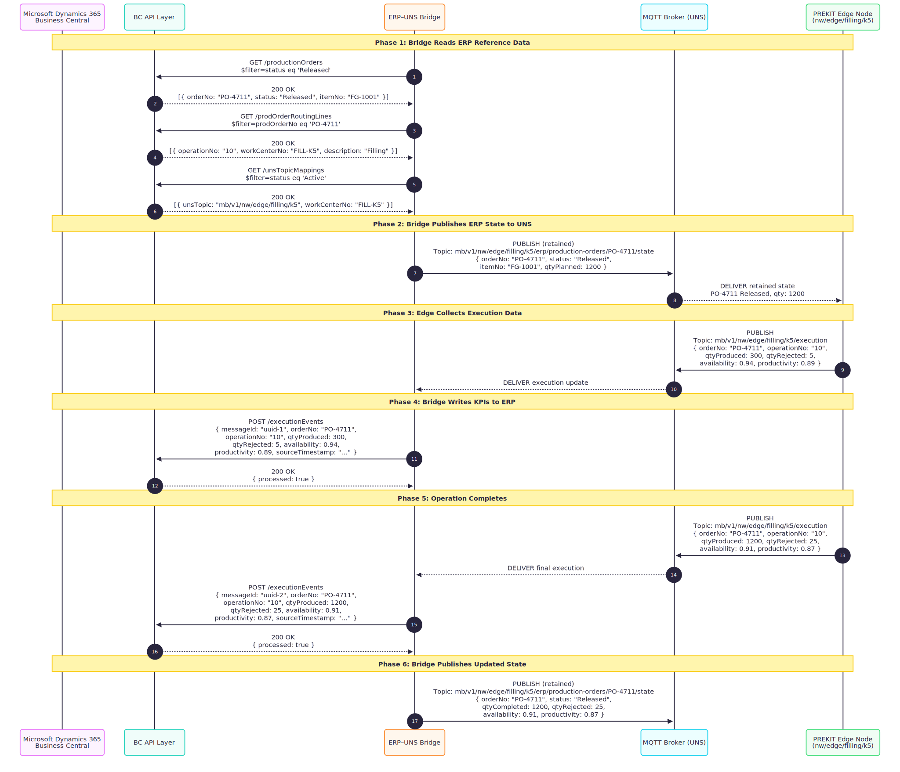
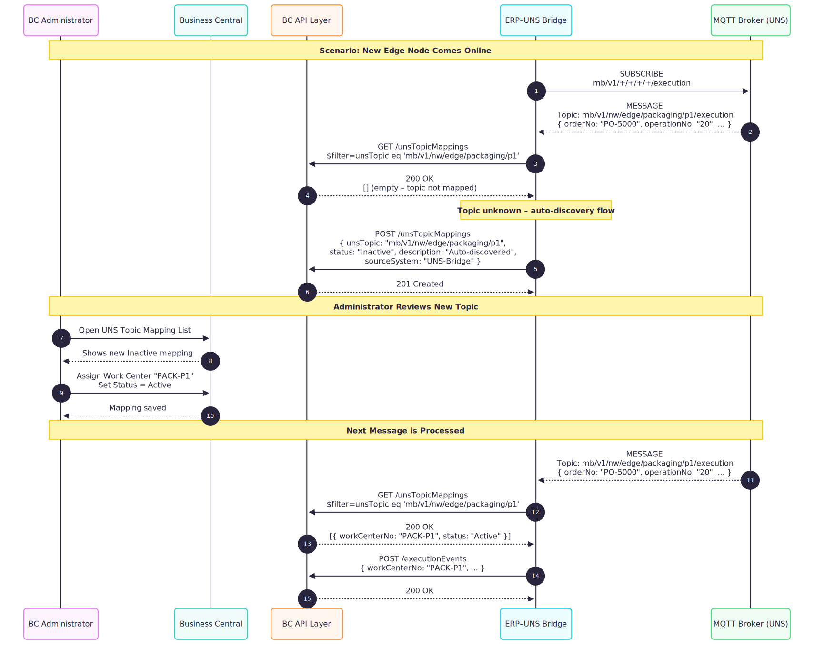
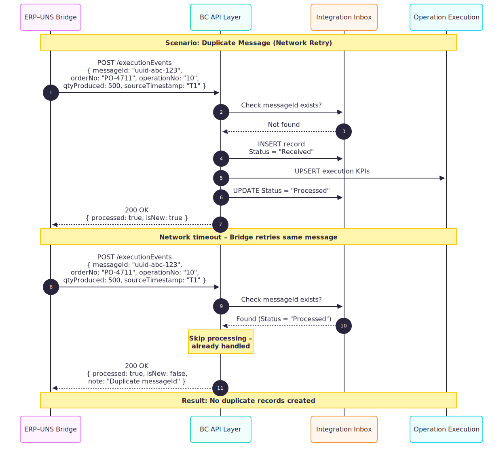
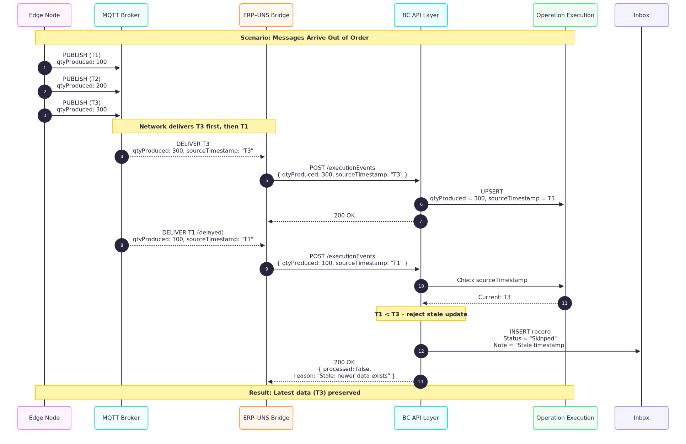

# UNS Bridge Connector

A Dynamics 365 Business Central AL extension that connects Business Central to the Unified Namespace (UNS) for bidirectional shopfloor integration.

## Overview

This extension provides the ERP side of a UNS (Unified Namespace) architecture, enabling bidirectional communication between Business Central and shopfloor systems via an external Bridge service. The Bridge connects to both the MQTT broker (UNS) and the BC REST APIs.



### How It Works

1. **Bridge reads ERP reference data** via REST APIs (Production Orders, Routings, Work Centers, Items)
2. **Bridge publishes ERP state** to the UNS for edge nodes to consume
3. **Edge nodes publish execution events** to the UNS
4. **Bridge subscribes to execution events** and writes KPIs back to BC via REST API
5. **BC stores and aggregates KPIs** with idempotency and out-of-order protection

## Features

**APIs (Write)**
- REST API endpoint for KPI ingestion (`/executionEvents`)
- UNS Topic Mapping API for ERP-hosted configuration (`/unsTopicMappings`)

**APIs (Read-Only Reference Data)**
- Production Orders, Routing Lines, Components
- Work Centers, Routings, Items

**Data Integrity**
- Idempotent API with message-level deduplication
- Out-of-order protection via source timestamps
- Integration inbox for audit trail and troubleshooting

**Configuration**
- UNS Topic Mapping with auto-discovery support
- Dynamic operation resolution from Work Center

**Reporting**
- Daily Execution Performance Report
- Read-only KPI pages on Production Orders and Routing Lines

## Data Model

The extension adds three new tables and extends two standard tables:



| Table | Purpose |
|-------|---------|
| **ALP Integration Inbox** | Audit trail of all received messages (idempotency key) |
| **ALP Operation Execution** | KPI storage per Order + Operation |
| **ALP UNS Topic Mapping** | Configuration: UNS Topic → Work Center |
| Production Order (ext) | Aggregated execution fields |
| Prod. Order Routing Line (ext) | Per-operation KPI fields |

## Bridge Communication Patterns

### Full Production Cycle

This sequence shows a complete production cycle from order release to completion:



### Topic Auto-Discovery

When the Bridge encounters unknown UNS topics, it can register them for later mapping:



### Idempotency Handling

The API safely handles duplicate messages (e.g., network retries):



### Out-of-Order Protection

Messages arriving out of order do not corrupt the latest state:



## Scope and Non-Goals

### In Scope
- Receiving aggregated KPIs from external systems
- Storing execution metrics safely
- Displaying metrics in BC UI (read-only)
- Idempotency and out-of-order handling
- UNS Topic → Work Center mapping (ERP-hosted configuration)
- Reference data APIs for Bridge consumption

### Out of Scope (Non-Goals)
- Posting journal entries or transactions
- Cost calculations or variance analysis
- MES business logic or scheduling
- Real-time data streaming
- The Bridge service itself (this is app-side only)

## Object ID Allocation

| ID | Type | Name |
|----|------|------|
| 50000 | Enum | ALP Integration Status |
| 50001 | Enum | ALP UNS Mapping Status |
| 50001 | Table | ALP Integration Inbox |
| 50002 | Table | ALP Operation Execution |
| 50003 | TableExt | ALP Production Order Ext |
| 50004 | TableExt | ALP Prod Order Rtng Line Ext |
| 50005 | Table | ALP UNS Topic Mapping |
| 50010 | Codeunit | ALP Execution Ingestion Svc |
| 50012 | Codeunit | ALP Execution Calc Svc |
| 50020 | Page | ALP Integration Inbox List |
| 50021 | PageExt | ALP Production Order Ext |
| 50022 | PageExt | ALP Prod Order Rtng Lines Ext |
| 50023 | Page | ALP UNS Topic Mapping List |
| 50030 | API Page | ALP Execution Events API |
| 50031 | API Page | ALP Work Centers API |
| 50032 | API Page | ALP Production Orders API |
| 50033 | API Page | ALP Prod Order Routing API |
| 50034 | API Page | ALP Prod Order Components API |
| 50036 | API Page | ALP Integration Inbox API |
| 50037 | API Page | ALP Routings API |
| 50038 | API Page | ALP Items API |
| 50039 | API Page | ALP UNS Topic Mapping API |
| 50040 | PermissionSet | ALP Shopfloor View |
| 50041 | PermissionSet | ALP Shopfloor Exec |
| 50051 | Report | ALP Daily Exec Performance |

## Technical Details

| Property | Value |
|----------|-------|
| Platform | 26.0 (BC 2025 Wave 1) |
| Runtime | 14.0 |
| Target | Cloud (SaaS) |

## API Reference

### Endpoint

```
POST /api/alpamayo/shopfloor/v1.0/companies({companyId})/executionEvents
```

### Authentication

OAuth 2.0 Bearer token with `https://api.businesscentral.dynamics.com` resource.

### Request Body

```json
{
  "messageId": "11111111-1111-1111-1111-111111111111",
  "orderNo": "101001",
  "operationNo": "10",
  "workCenter": "MACH0001",
  "qtyProduced": 100,
  "qtyRejected": 5,
  "runtimeSec": 3600,
  "downtimeSec": 300,
  "availability": 0.92,
  "productivity": 0.85,
  "actualCycleTimeSec": 36.5,
  "sourceTimestamp": "2024-01-24T10:30:00Z",
  "source": "MES-SCADA"
}
```

### Field Definitions

| Field | Type | Required | Description |
|-------|------|----------|-------------|
| messageId | GUID | Yes | Unique message ID for idempotency |
| orderNo | Code[20] | Yes | Production Order number |
| operationNo | Code[10] | No* | Operation number in routing (*Required if Work Center has multiple operations on the order) |
| workCenter | Code[20] | No* | Work Center code (*Required if operationNo is not specified) |
| qtyProduced | Integer | No | Quantity produced (total) |
| qtyRejected | Integer | No | Quantity rejected (must be <= qtyProduced) |
| runtimeSec | Decimal | No | Runtime in seconds |
| downtimeSec | Decimal | No | Downtime in seconds |
| availability | Decimal | No | Availability ratio (0-1) |
| productivity | Decimal | No | Productivity ratio (0-1) |
| actualCycleTimeSec | Decimal | No | Actual cycle time in seconds |
| sourceTimestamp | DateTime | Yes | Timestamp from source system |
| source | Code[20] | No | Source system identifier |

### Response

- **200 OK**: Message processed successfully (or already processed)
- **400 Bad Request**: Validation failed (check error message)

## UNS Topic Mapping

The UNS Topic Mapping feature provides **static integration configuration** for mapping UNS (Unified Namespace) topics to ERP Work Centers. Operation No. is resolved **dynamically at execution time** based on Production Order context.

### Architecture

- **Mappings are configuration-only**: UNS Topic → Work Center
- **Mappings stored in ERP**: Auditable, configurable via BC admin UI
- **Bridge fetches mappings**: Bridge service calls the API and resolves locally
- **Bridge sends Work Center**: Existing API contract unchanged
- **ERP resolves Operation dynamically**: Based on Production Order routing

### Admin UI

Open **UNS Topic Mappings** page in Business Central (under Administration) to:
- Create, edit, and delete mappings
- Activate/deactivate mappings
- View Work Center details in the FactBox

### API Endpoint

```
GET /api/alpamayo/shopfloor/v1.0/companies({companyId})/unsTopicMappings
```

### Mapping Fields

| Field | Type | Description |
|-------|------|-------------|
| unsTopic | Text[250] | UNS topic path (e.g., `mb/v1/nw/edge/filling/k5/assembly`) |
| workCenterNo | Code[20] | Target Work Center in Business Central (optional) |
| status | Enum | Active or Inactive |
| description | Text[100] | Human-readable description |
| sourceSystem | Code[20] | Source system identifier |
| validFrom | Date | Start validity date |
| validTo | Date | End validity date (0D = no end) |
| createdAt | DateTime | Audit timestamp |
| createdBy | Code[50] | Audit user |

### Nullable Work Center (Auto-Discovery)

The `workCenterNo` field is optional to support auto-discovery workflows:

1. **Bridge discovers new UNS topics** automatically from MQTT broker
2. **Bridge registers topics** in the mapping table without Work Center assignment
3. **Users assign Work Centers** later via admin UI or API

Mappings without a Work Center are considered "discovered but unmapped" and are displayed with an **Attention** style (yellow) in the UI. The bridge must skip unmapped topics when resolving execution events.

### Example Mapping

| UNS Topic | Work Center | Description |
|-----------|-------------|-------------|
| `mb/v1/nw/edge/filling/k5/assembly` | MACH0001 | K5 Assembly Station |
| `mb/v1/nw/edge/filling/k5/testing` | MACH0002 | K5 Testing Station |

### Bridge Resolution Flow

1. Bridge receives MQTT message on UNS topic
2. Bridge fetches mappings: `GET /unsTopicMappings?$filter=status eq 'Active'`
3. Bridge resolves UNS topic → Work Center
4. Bridge sends execution event with resolved `workCenter` (and optionally `operationNo`)
5. Bridge provides `orderNo` from context (e.g., active order on the machine)

### Dynamic Operation Resolution

When the bridge sends an execution event **without** `operationNo`, the ERP dynamically resolves it:

1. Filter Production Order Routing Lines by Order No. and Work Center
2. **Exactly 1 match**: Use that Operation No.
3. **0 matches**: Fail with error "No routing line found for Order X, Work Center Y"
4. **Multiple matches**: Fail with error "Multiple routing lines found... Operation No. must be specified"

This approach:
- Keeps mapping configuration simple (UNS Topic → Work Center only)
- Supports the same UNS topic across multiple operations without configuration changes
- Validates against actual Production Order data at runtime
- Fails explicitly and safely when ambiguous

### WorkCenter Validation

When `operationNo` **is** provided in the payload, the ERP validates that the routing line's Work Center matches the payload's `workCenter`. A mismatch results in a **hard failure** and the event is rejected.

## Items API

Read-only reference data API for manufacturing items.

### Endpoint

```
GET /api/alpamayo/shopfloor/v1.0/companies({companyId})/items
```

### Permissions

Read-only. Insert, modify, and delete operations are not allowed.

### Fields

| Field | Type | Description |
|-------|------|-------------|
| id | GUID | System ID |
| number | Code[20] | Item number |
| description | Text[100] | Item description |
| type | Enum | Item type (Inventory, Service, Non-Inventory) |
| baseUnitOfMeasure | Code[10] | Base unit of measure |
| itemCategoryCode | Code[20] | Item category |
| routingNumber | Code[20] | Default routing number |
| productionBOMNumber | Code[20] | Production BOM number |
| replenishmentSystem | Enum | Replenishment system (Purchase, Prod. Order, etc.) |
| manufacturingPolicy | Enum | Manufacturing policy (Make-to-Stock, Make-to-Order) |

## Test Harness

### Prerequisites

```bash
# Get OAuth token using Azure CLI
az login
ACCESS_TOKEN=$(az account get-access-token --resource https://api.businesscentral.dynamics.com --query accessToken -o tsv)

# Set environment variables
BC_TENANT="your-tenant-id"
BC_ENV="Sandbox"
BC_COMPANY="your-company-id"
```

### 1. Normal Insert

```bash
curl -X POST "https://api.businesscentral.dynamics.com/v2.0/${BC_TENANT}/${BC_ENV}/api/alpamayo/shopfloor/v1.0/companies(${BC_COMPANY})/executionEvents" \
  -H "Authorization: Bearer ${ACCESS_TOKEN}" \
  -H "Content-Type: application/json" \
  -d '{
    "messageId": "11111111-1111-1111-1111-111111111111",
    "orderNo": "101001",
    "operationNo": "10",
    "workCenter": "MACH0001",
    "qtyProduced": 100,
    "qtyRejected": 5,
    "runtimeSec": 3600,
    "downtimeSec": 300,
    "availability": 0.92,
    "productivity": 0.85,
    "actualCycleTimeSec": 36.5,
    "sourceTimestamp": "2024-01-24T10:30:00Z",
    "source": "MES-SCADA"
  }'
```

### 2. Idempotency Test (Duplicate messageId)

Run the same command again. Should return 200 OK without creating duplicate records.

### 3. Out-of-Order Test (Older Timestamp)

```bash
curl -X POST "https://api.businesscentral.dynamics.com/v2.0/${BC_TENANT}/${BC_ENV}/api/alpamayo/shopfloor/v1.0/companies(${BC_COMPANY})/executionEvents" \
  -H "Authorization: Bearer ${ACCESS_TOKEN}" \
  -H "Content-Type: application/json" \
  -d '{
    "messageId": "22222222-2222-2222-2222-222222222222",
    "orderNo": "101001",
    "operationNo": "10",
    "workCenter": "MACH0001",
    "qtyProduced": 90,
    "sourceTimestamp": "2024-01-24T09:00:00Z",
    "source": "MES-SCADA"
  }'
```

Should return 200 OK but NOT update the execution record (older timestamp skipped).

### 4. Invalid Availability (> 1)

```bash
curl -X POST "https://api.businesscentral.dynamics.com/v2.0/${BC_TENANT}/${BC_ENV}/api/alpamayo/shopfloor/v1.0/companies(${BC_COMPANY})/executionEvents" \
  -H "Authorization: Bearer ${ACCESS_TOKEN}" \
  -H "Content-Type: application/json" \
  -d '{
    "messageId": "33333333-3333-3333-3333-333333333333",
    "orderNo": "101001",
    "operationNo": "10",
    "availability": 1.5,
    "sourceTimestamp": "2024-01-24T11:00:00Z"
  }'
```

Should return 400 Bad Request.

### 5. Rejected > Produced

```bash
curl -X POST "https://api.businesscentral.dynamics.com/v2.0/${BC_TENANT}/${BC_ENV}/api/alpamayo/shopfloor/v1.0/companies(${BC_COMPANY})/executionEvents" \
  -H "Authorization: Bearer ${ACCESS_TOKEN}" \
  -H "Content-Type: application/json" \
  -d '{
    "messageId": "44444444-4444-4444-4444-444444444444",
    "orderNo": "101001",
    "operationNo": "10",
    "qtyProduced": 10,
    "qtyRejected": 20,
    "sourceTimestamp": "2024-01-24T11:00:00Z"
  }'
```

Should return 400 Bad Request.

### 6. Non-Existent Production Order

```bash
curl -X POST "https://api.businesscentral.dynamics.com/v2.0/${BC_TENANT}/${BC_ENV}/api/alpamayo/shopfloor/v1.0/companies(${BC_COMPANY})/executionEvents" \
  -H "Authorization: Bearer ${ACCESS_TOKEN}" \
  -H "Content-Type: application/json" \
  -d '{
    "messageId": "55555555-5555-5555-5555-555555555555",
    "orderNo": "NONEXISTENT",
    "operationNo": "10",
    "sourceTimestamp": "2024-01-24T11:00:00Z"
  }'
```

Should return 400 Bad Request.

## Bridge CLI Demo Flow

The Bridge CLI provides a convenient way to test the integration without manual curl commands.

### Setup

```bash
# Navigate to the bridge CLI directory
cd dev/bridge

# Install dependencies
pip install -e .

# Configure environment (.env file)
BC_TENANT=your-tenant-id
BC_ENV=Sandbox
BC_COMPANY=your-company-id

# Authenticate via Azure CLI
az login
```

### Complete Demo Workflow

```bash
# ─────────────────────────────────────────────────────────────────
# STEP 1: Verify Connection
# ─────────────────────────────────────────────────────────────────
bridge auth                    # Verify OAuth token works
bridge config                  # Show current configuration

# ─────────────────────────────────────────────────────────────────
# STEP 2: Create a Production Order (uses existing Cronus items)
# ─────────────────────────────────────────────────────────────────
bridge setup prod-order --item SP-BOM2000 --quantity 100 --due-date 2026-01-26

# ─────────────────────────────────────────────────────────────────
# STEP 3: Discover Production Orders and Routing
# ─────────────────────────────────────────────────────────────────
bridge get-orders              # List released production orders
bridge get-routing 101023      # Check routing lines for the order

# ─────────────────────────────────────────────────────────────────
# STEP 4: Post Execution Events (KPIs - no inventory impact)
# ─────────────────────────────────────────────────────────────────
# Post execution event for operation 10 (Reservoirmontage)
bridge post-event --order 101023 --operation 10 \
  --qty-produced 50 --qty-rejected 2 \
  --availability 0.95 --productivity 0.90

# Post execution event for operation 20 (Elektrische Verdrahtung)
bridge post-event --order 101023 --operation 20 \
  --qty-produced 48 --qty-rejected 1 \
  --availability 0.92 --productivity 0.88

# Post execution event for operation 30 (Testen)
bridge post-event --order 101023 --operation 30 \
  --qty-produced 47 --qty-rejected 0 \
  --availability 0.98 --productivity 0.95

# ─────────────────────────────────────────────────────────────────
# STEP 5: View Execution Inbox
# ─────────────────────────────────────────────────────────────────
bridge get-inbox                    # View execution events

# ─────────────────────────────────────────────────────────────────
# STEP 6: Verify in Business Central UI
# ─────────────────────────────────────────────────────────────────
# Open Released Production Order 101023 and check:
# - Execution KPIs section (Qty. Produced, Qty. Rejected, Qty. Good)
# - Routing subpage (per-operation KPIs)

# ─────────────────────────────────────────────────────────────────
# CLEANUP (optional)
# ─────────────────────────────────────────────────────────────────
bridge setup cleanup --status Released  # Delete released orders
```

### Verify in Business Central

1. Open **Released Production Order** 101023
2. Check the **Execution KPIs** section:
   - Qty. Produced (aggregated from all operations)
   - Qty. Rejected
   - Qty. Good (derived)
   - Progress %
   - Availability (weighted)
   - Productivity (weighted)
3. Open **Routing** subpage to see per-operation KPIs

### Test Scenarios

```bash
# Test idempotency (re-post same event)
bridge post-event --order RPO-00001 --operation 10 \
  --qty-produced 50 --qty-rejected 2
# Result: Returns success, no duplicate data

# Test validation (invalid routing line)
bridge post-event --order RPO-00001 --operation 99 --qty-produced 10
# Result: Error - routing line not found

# Test validation (rejected > produced)
bridge post-event --order RPO-00001 --operation 10 \
  --qty-produced 10 --qty-rejected 20
# Result: Error - Qty. Rejected cannot exceed Qty. Produced
```

## Development

### Prerequisites

- Visual Studio Code
- AL Language extension (`ms-dynamics-smb.al`)
- Business Central sandbox environment

### Getting Started

1. Open the project folder in VS Code
2. Press `Cmd+Shift+P` (Mac) or `Ctrl+Shift+P` (Windows) and run "AL: Download Symbols"
3. Configure your sandbox in `.vscode/launch.json`
4. Press `F5` to publish and debug

### Building

Press `Cmd+Shift+B` (Mac) or `Ctrl+Shift+B` (Windows) and select "AL: Package" to build the `.app` file.

### Debugging

1. Set breakpoints in `ALPExecutionIngestionSvc.Codeunit.al`
2. Press `F5` to deploy to sandbox
3. Send test API requests via curl or Postman
4. Breakpoints will trigger in VS Code

## Project Structure

```
d365_uns_app/
├── app.json                    # Extension manifest
├── src/
│   ├── Table/
│   │   ├── ALPIntegrationStatus.Enum.al
│   │   ├── ALPIntegrationInbox.Table.al
│   │   ├── ALPOperationExecution.Table.al
│   │   ├── ALPProductionOrderExt.TableExt.al
│   │   ├── ALPProdOrderRtngLineExt.TableExt.al
│   │   ├── ALPShopfloorView.PermissionSet.al
│   │   └── ALPShopfloorExec.PermissionSet.al
│   ├── Codeunit/
│   │   └── ALPExecutionIngestionSvc.Codeunit.al
│   ├── Page/
│   │   ├── ALPIntegrationInboxList.Page.al
│   │   ├── ALPProductionOrderPageExt.PageExt.al
│   │   └── ALPProdOrderRtngLinesPageExt.PageExt.al
│   └── API/
│       └── ALPExecutionEventsAPI.Page.al
├── .vscode/                    # VS Code configuration
├── LICENSE                     # MIT License
└── README.md                   # This file
```

## Permission Sets

| Permission Set | ID | Purpose | Grants |
|----------------|-----|---------|--------|
| ALP Shopfloor View | 50040 | Dashboard viewers | Read-only on all tables, Execute on view pages |
| ALP Shopfloor Exec | 50041 | Report execution KPIs | Insert/Modify on execution tables, Execute on execution API |

**User Assignment:**
| Role | Permission Sets |
|------|-----------------|
| Dashboard Viewer | View |
| Shopfloor Device (SCADA/MES) | View + Exec |
| Integration Service Account | View + Exec |

## Supported Languages

| Language | Locale Code | Status |
|----------|-------------|--------|
| English | en-US | Base language |
| German | de-DE | Fully translated |

Language selection is automatic based on user profile settings in Business Central (Settings > My Settings > Language).

## Related Repositories

| Repository | Description |
|------------|-------------|
| [Dynamics365-BC-UNS-Tests](https://github.com/alpamayo-solutions/Dynamics365-BC-UNS-Tests) | Automated test suite for this extension |

## License

MIT License - see [LICENSE](LICENSE) file.
